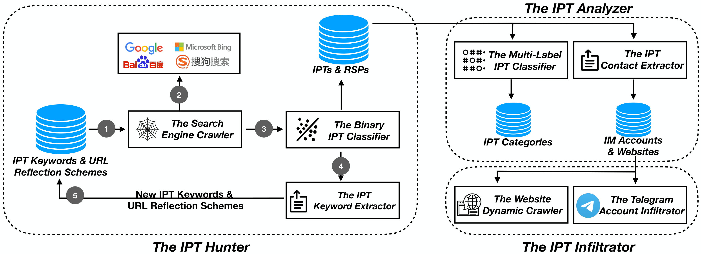

# Reflected Search Poisoning for Illicit Promotion

[](https://arxiv.org/abs/2404.05320)
 [](https://chasesecurity.github.io/ReflectedBlackSEO/)

## Data

To prevent miscreants from launching new RSP attacks, we hide the vulnerable URSes and make the rest of the data public which include the [IPT search keywords](https://drive.google.com/file/d/1L1yePl_evc-1OhyD3nOMMxhNjVlQCH_D/view?usp=drive_link), [the IPTs](https://drive.google.com/file/d/1zeLtwGIMo3NEkSdVT2G_IE923nrpWkPA/view?usp=drive_link), [the IPT contacts of various categories](https://drive.google.com/file/d/1lFwodHIV6sSVqJy4L-vAu3zi0jM0SEVT/view?usp=drive_link) and the [messages collected from Telegram](https://drive.google.com/file/d/16bA7E9vqEFbuD3QttfPH6Tc43xJnWuDs/view?usp=drive_link).

## Code


As shown in the figure above, our methodology consists of three major components. One is to discover IPTs and RSPs through the IPT hunter. Then, given IPTs, an analyzer is further applied to profile IPT categories and extract contact identifiers as embedded in IPTs, through which, a large volume of contacts including instant messaging accounts and websites have been discovered. To reveal what these contacts will redirect a victim to, an IPT infiltrator is designed to automatically visit and profile  websites and Telegram accounts that are promoted in IPTs.

For these crawlers, we open-source the runnable codes. And for these models, we open-source the scripts for training and testing as well as the ground truth datasets.

### Search Engine Crawler

Deploy a crawler to obtain reflected search poisoning data from four search engines: Google, Bing, Baidu, Sogou.

### Binary IPT Classifier

A Random Forest classifier trained with 2,229 positive data and 1,468 negative data to distinguish RSPs from benign URL reflections. 

### IPT Keyword Extractor

A Random Forest classifier trained with 1,012 positive data and 3,170 negative data to decide whether an IPT segment is a contact segment or not, which is a good search keyword in terms of guiding the search engines and discovering new RSPs/IPTs.

### Multi-label IPT Classifier

By fine tuning the multilingual BERT model, we build this classifier to classify IPT as either a harmless 'Benign' category or one or more of the 14 illicit services/goods categories.

### IPT Contact Extractor

Taking an IPT as the input, our contact extractor is designed to extract all the embedded contact entities, which is achieved by a contact type classifier and contact entity extractors.

### Website Dynamic Crawler

By instrumenting a headless browser, we capture the final landing webpage as a screenshot and save all the network traffic of both HTTP requests and HTTP responses. 

### Telegram Account Infiltrator

Leveraging publicly available Telegram APIs, we can extract the profile of each Telegram account at a weekly pace.

## BibTex

```
@misc{wu2024reflected,
      title={Reflected Search Poisoning for Illicit Promotion}, 
      author={Sangyi Wu and Jialong Xue and Shaoxuan Zhou and Xianghang Mi},
      year={2024},
      eprint={2404.05320},
      archivePrefix={arXiv},
      primaryClass={cs.CR}
}
```